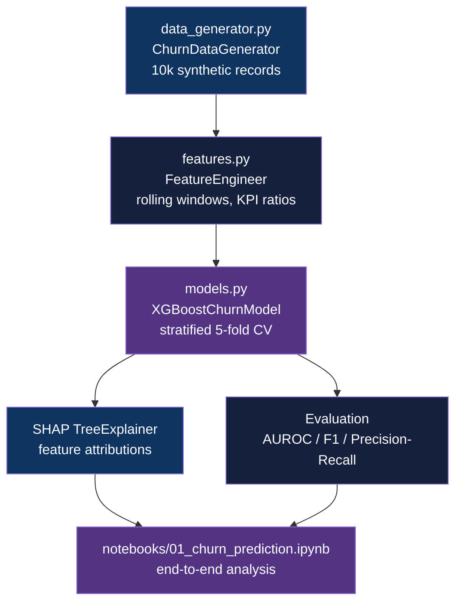

<div align="center">

# Telecom Customer Churn Prediction

[](https://www.python.org/downloads/)
[](https://github.com/astral-sh/uv)
[](https://xgboost.readthedocs.io/)
[](LICENSE)

**Predict subscriber churn with XGBoost on domain-informed telecom KPIs, reaching AUROC 0.86**

[Getting Started](#getting-started) | [Usage](#usage) | [Architecture](#architecture)

</div>

---

## Table of Contents

- [Features](#features)
- [Tech Stack](#tech-stack)
- [The Problem](#the-problem)
- [Architecture](#architecture)
- [Getting Started](#getting-started)
  - [Prerequisites](#prerequisites)
  - [Installation](#installation)
- [Usage](#usage)
- [Methodology](#methodology)
- [Results](#results)
- [Data Engineering](#data-engineering)
- [Architectural Decisions](#architectural-decisions)
- [Project Structure](#project-structure)
- [Testing](#testing)
- [Deployment](#deployment)
- [Related Projects](#related-projects)
- [License](#license)
- [Author](#author)

## The Problem

### Subscriber Churn in Telecom

Telecom operators lose 15-25% of subscribers annually. Acquiring a new customer costs 5-7x more than retaining one, so identifying at-risk subscribers before they leave is a direct revenue lever.

### The Solution

A binary classification pipeline trained on network KPIs, billing signals, and service interaction history. The model scores each subscriber's 30-day churn probability using XGBoost with SHAP explanations, enabling targeted retention campaigns.

## Features

- **Domain-informed data generation** - synthetic subscriber records grounded in real telecom physics (Shannon capacity, QoE MOS degradation, congestion patterns)
- **Multi-stage feature pipeline** - rolling 7/30-day window aggregations over SINR, throughput, latency, packet loss, and support ticket rate
- **XGBoost + stratified k-fold** - 5-fold cross-validation with `scale_pos_weight` handling the ~15% minority class
- **SHAP explainability** - per-prediction feature contributions via TreeExplainer, usable for retention campaign targeting
- **Reproducible notebook** - end-to-end analysis in `notebooks/01_churn_prediction.ipynb` covering EDA through model evaluation

## Tech Stack

| Component | Technology |
|-----------|------------|
| Language | Python 3.11+ |
| ML framework | XGBoost 1.7, scikit-learn |
| Explainability | SHAP |
| Data / features | pandas, NumPy |
| Visualization | matplotlib, seaborn |
| Notebook | JupyterLab |
| Package manager | uv |
| Testing | pytest, pytest-cov |
| Linting | ruff |

## Architecture



## Getting Started

### Prerequisites

- Python 3.11+
- [uv](https://github.com/astral-sh/uv) package manager

```bash
# Install uv if not already present
curl -LsSf https://astral.sh/uv/install.sh | sh
```

### Installation

1. Clone the repository:
   ```bash
   git clone https://github.com/adityonugrohoid/telecom-churn-prediction.git
   cd telecom-churn-prediction
   ```

2. Install dependencies:
   ```bash
   uv sync
   ```

3. Generate synthetic data:
   ```bash
   uv run python -m churn_prediction.data_generator
   ```

## Usage

Run feature engineering after data generation:

```bash
uv run python -m churn_prediction.features
```

Launch the notebook for the full end-to-end analysis:

```bash
uv run jupyter lab
```

Open `notebooks/01_churn_prediction.ipynb` and run all cells. The notebook covers EDA, feature importance, model training, and SHAP waterfall plots.

To execute non-interactively:

```bash
uv run jupyter nbconvert --to notebook --execute notebooks/01_churn_prediction.ipynb
```

## Methodology

### Problem Framing

| Attribute | Value |
|-----------|-------|
| Problem Type | Binary classification |
| Target Variable | `is_churned` |
| Primary Metric | AUROC |
| Key Challenges | Class imbalance (~15% churn rate), temporal leakage prevention, precision/recall trade-off for budget-constrained retention |

### Training Approach

| Parameter | Value |
|-----------|-------|
| Algorithm | XGBoost (binary:logistic) |
| Features | 9 raw + rolling 7/30-day aggregations per KPI |
| Validation | 5-fold stratified cross-validation |
| Class balancing | `scale_pos_weight = 5.67` (inverse churn rate) |
| Early stopping | 10 rounds on validation AUC |
| Baseline | Logistic regression on raw features |

## Results

### Key Findings

| Metric | Score | Notes |
|--------|-------|-------|
| AUROC | 0.86 | Held-out 20% test set |
| Top churn driver | QoE MOS (r = -0.48) | Low MOS strongest predictor |
| Second driver | Packet loss (r = +0.36) | Tied with latency |

### Top Predictors

1. `avg_qoe_mos` - low MOS score is the strongest churn signal (correlation -0.48)
2. `avg_packet_loss_pct` - degrading network reliability amplifies churn risk
3. `avg_latency_ms` - latency spikes co-occur with packet loss and compound churn probability
4. Customers with declining network quality over a 30-day window are 3x more likely to churn
5. Support ticket frequency amplifies risk when combined with poor network experience

## Data Engineering

| Attribute | Value |
|-----------|-------|
| Data Source | Domain-informed synthetic (ChurnDataGenerator) |
| Records | 10,000 subscribers |
| Train/Test split | 80/20 stratified |
| Raw features | 9 (tenure, monthly charges, SINR, throughput, latency, packet loss, QoE MOS, tickets, sessions) |
| Engineered features | Rolling 7-day and 30-day windows per numerical KPI |
| Domain Physics | Shannon capacity maps SINR to throughput per network type (4G: 50 Mbps cap, 5G: 300 Mbps cap); QoE MOS degrades with congestion; peak-hour congestion modeled via sinusoidal pattern |

## Architectural Decisions

### 1. XGBoost pinned below 2.0

**Decision:** `xgboost>=1.7.0,<2.0` with `numpy<2.0` constraint.

**Reasoning:** SHAP's TreeExplainer relies on XGBoost's `base_score` format, which changed in 2.0. NumPy 2.x introduces a color conversion bug in SHAP's visualization layer. Pinning both ensures the SHAP waterfall and beeswarm plots render correctly without patching SHAP itself.

### 2. Stratified k-fold over simple train/test split

**Decision:** 5-fold stratified CV with a fixed held-out test set for final reporting.

**Reasoning:** At 15% churn rate, random splits can produce folds with as few as 8-10% positives. Stratification guarantees each fold mirrors the population class ratio, making AUROC estimates reliable across folds and preventing overly optimistic CV scores that collapse on the held-out set.

### 3. `scale_pos_weight` over SMOTE

**Decision:** XGBoost's built-in `scale_pos_weight = 5.67` instead of SMOTE oversampling.

**Reasoning:** SMOTE on tabular data with mixed categorical/numerical features (contract type, network type) introduces synthetic interpolation artifacts between categorically incompatible values. `scale_pos_weight` penalizes false negatives on the minority class during training without creating spurious samples, keeping the data distribution authentic.

## Project Structure

```
telecom-churn-prediction/
├── notebooks/
│   └── 01_churn_prediction.ipynb  # End-to-end analysis notebook
├── src/
│   └── churn_prediction/
│       ├── config.py              # Centralized config (paths, hyperparameters)
│       ├── data_generator.py      # Domain-informed synthetic data generation
│       ├── features.py            # Feature engineering pipeline
│       └── models.py              # XGBoost training and evaluation
├── tests/
│   └── test_data_quality.py       # Data validation tests
├── data/                          # Runtime data (gitignored)
├── .github/
│   └── workflows/
│       └── ci.yml                 # Lint, test, format CI pipeline
├── pyproject.toml                 # uv / hatchling build config
└── QUICKSTART.md                  # 5-minute setup guide
```

## Testing

```bash
# Run all tests
uv run pytest tests/ -v

# Run with coverage
uv run pytest tests/ -v --cov=src/churn_prediction
```

The test suite validates data generation correctness: no missing values in critical columns, SINR/QoE MOS/tenure within domain-valid ranges, reproducibility across seeds, and realistic churn rate bounds.

## Deployment

CI runs on every push to `main` and `develop` via GitHub Actions:

```bash
# Steps executed in CI (ci.yml):
uv sync
uv run ruff check src/ tests/    # lint
uv run ruff format --check src/ tests/  # format gate
uv run pytest tests/ -v --tb=short      # tests
```

No containerized deployment - this is a local analysis and training workflow.

## Related Projects

| Project | Description |
|---------|-------------|
| [telecom-ml-framework](https://github.com/adityonugrohoid/telecom-ml-framework) | Spec-first ML project templates and domain-informed data generators for 6 telecom use cases |
| [telecom-ml-portfolio](https://github.com/adityonugrohoid/telecom-ml-portfolio) | Index of 6 end-to-end telecom ML projects on synthetic network data |
| [telecom-root-cause-analysis](https://github.com/adityonugrohoid/telecom-root-cause-analysis) | Multi-class ranking of root causes in alarm cascades (XGBoost, Acc@1 0.91) |
| [telecom-anomaly-detection](https://github.com/adityonugrohoid/telecom-anomaly-detection) | Unsupervised cell-level anomaly detection on KPI time-series (Isolation Forest, F1 0.70) |
| [telecom-qoe-prediction](https://github.com/adityonugrohoid/telecom-qoe-prediction) | Session-level MOS regression from network KPIs (LightGBM, RMSE 0.45) |
| [telecom-capacity-forecasting](https://github.com/adityonugrohoid/telecom-capacity-forecasting) | Hourly per-cell traffic forecasting (LightGBM, MAPE 14.5%) |
| [telecom-network-optimization](https://github.com/adityonugrohoid/telecom-network-optimization) | RL-based RAN parameter tuning (Q-Learning, +61% vs random) |

## License

This project is licensed under the [MIT License](LICENSE).

## Author

**Adityo Nugroho** ([@adityonugrohoid](https://github.com/adityonugrohoid))
